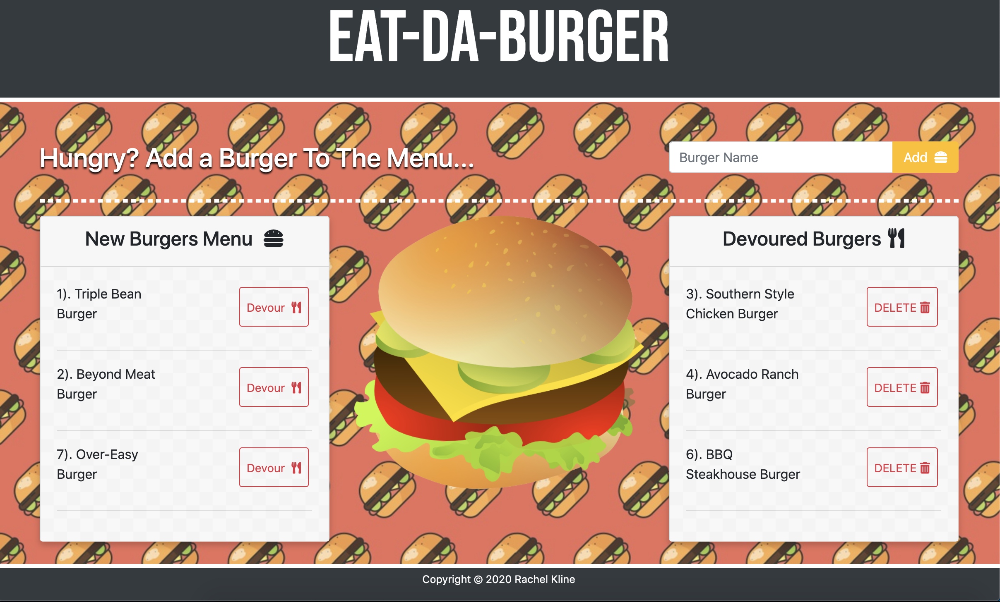

# Eat-Da-Burger


## Deployed Site:
https://thawing-earth-42129.herokuapp.com/



---

## Description

  *The what, why, and how:*

In this assignment, we were tasked with creating a burger logger with MySQL, Node, Express, Handlebars and a homemade ORM. This application lets users input the names of burgers they'd like to eat. When the user submits a burger's name, the burger is displayed on the left side of the page waiting to be devoured.

Each burger has a `Devour` button that when clicked, will move the burger to the right side of the page. Every burger is stored in a database, whether devoured or not.

We were also challenged to add a `DELETE` button and make it functional (able to be deleted from the database) as a bonus.


  ---


## Table of Contents

  - [Deployed Site](#deployed-site)
  - [Description](#description)
  - [Usage](#usage)
  - [Installation](#installation)
  - [Directory Structure](#directory-structure)
  - [Questions](#questions)
 
 ---


## Usage
  *Instructions and examples for use:*

To run this application locally:
1. Create a MySQL database and run the following to set the schema:
    
    * db/schema.sql
   
    * db/seeds.sql
2. Configure the database connection settings in config/connection.js
3. Navigate to the repository folder and run server.js to start:
   ```
   $ node server.js
   ```
4. Open localhost:8000 in your browser
5. Add burgers to the New Burgers Menu and eat them!!
---


## Installation
*How to set up & install:*

**PRE-REQUESITES:**
Eat-Da-Burger requires Node.js to be installd. To install node, visit the [Node.js website](https://nodejs.org/en/ "Node.js") and install node for your operating system

**THEN:**

1. Clone the Git repository

   ```
   $ git clone <repo>
   ```
2. Navigate to teh directory and install the dependencies
   ```
   $ npm install
   ```
---

## Directory Structure
```
.
├── config
│   ├── connection.js
│   └── orm.js
│ 
├── controllers
│   └── burger_controller.js
│
├── db
│   ├── schema.sql
│   └── seeds.sql
│
├── models
│   └── burger.js
│ 
├── node_modules
│ 
├── package.json
│
├── public
│   └── assets
│       ├── css
│       │   └── style.css
│       └── img
│           └── burger.png
│          js
│           └── app.js
│   
│
├── server.js
│
└── views
    ├── index.handlebars
    └── layouts
        └── main.handlebars
        partials
        └── eatenBurgers.handlebars
        └── uneatenBurgers.handlebars
```

---


## Questions?

  *For any questions about this application, please contact me via the information below:*

  * **GitHub:** https://github.com/users/rachelkline
  
  * **Email:** rachel_kline@icloud.com

---
  <br>

  [Icons provided by https://fontawesome.com/]